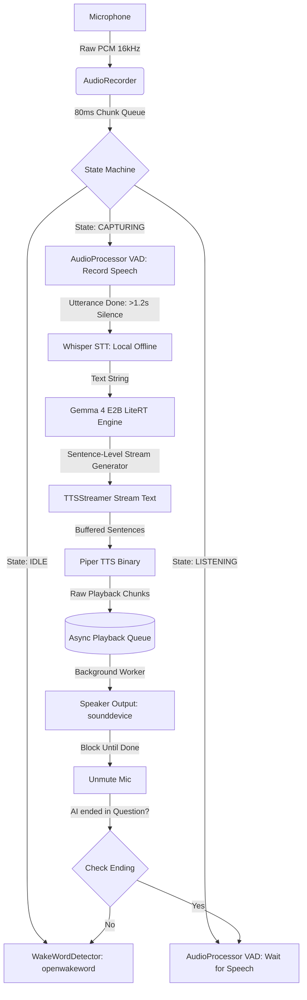

# Voice Assistant: Technical Architecture & Blueprint

This document provides a comprehensive, in-depth architectural breakdown and step-by-step walkthrough of the **SMALL VOICE ASSISTANT**. 

The assistant is engineered to be **100% offline, privacy-respecting, and cross-platform**, running with extremely low latency directly on consumer-grade CPUs (such as x86_64 PCs or ARM-based Raspberry Pi 5 boards) without relying on any external web APIs or cloud services.

---

## 1. System Architecture

The entire voice assistant is constructed as a decoupled, multi-threaded asynchronous state machine. 

Below is the conceptual architecture showing the flow of audio data, text streams, and system control:



---

## 2. Technical Component Deep-Dive

### 2.1 Audio Capture & Queueing (`src/audio/recorder.py`)
* **Technology**: `sounddevice` (built on PortAudio), `queue.Queue`.
* **Details**: 
  The audio recorder opens a non-blocking input stream configured at **16,000 Hz, Mono, Int16 (16-bit PCM)**. This sample rate is the gold standard expected by both openwakeword and Whisper.
  
  Audio is captured in **80ms blocks** (1280 samples). Each chunk is immediately put into a thread-safe `queue.Queue`. A dedicated generator yields chunks, ensuring that if the CPU experiences temporary spikes during heavy LLM inference, the microphone frames are not dropped or corrupted.

### 2.2 Wake-Word Detection (`src/audio/wakeword.py`)
* **Technology**: `openwakeword` (ONNX Runtime).
* **Details**:
  Uses an ultra-lightweight, ONNX-optimized wake-word engine. The `hey_jarvis_v0.1.onnx` model continuously evaluates the 80ms sliding audio frames.
  
  *Feature Integration:* To prevent the wake-word engine's internal buffer from losing sync (which happens when the stream is paused during speaking), the main loop continuously feeds all mic chunks to the detector. However, activation is dynamically suppressed if the state machine is currently capturing user speech to avoid false barge-ins.

### 2.3 Voice Activity Detection (`src/audio/processor.py`)
* **Technology**: Root Mean Square (RMS) energy analysis.
* **Details**:
  Calculates the amplitude energy of each 80ms audio chunk:
  $$\text{RMS} = \sqrt{\frac{1}{N}\sum_{i=1}^{N} x_i^2}$$
  
  If the chunk's RMS exceeds the threshold (**300**), it is marked as active speech.
  
  *Tuning for Natural Speech:* To prevent the assistant from interrupting the user when they take a brief breath between words, we use a count-based hangover timer (**15 chunks = 1.2 seconds of sustained silence**) before the capturing state decides the utterance is complete.

### 2.4 Offline Speech-to-Text (`src/main.py`)
* **Technology**: `openai-whisper` (Local CPU transcription).
* **Details**:
  We bypassed standard cloud APIs and native C++ LiteRT audio-injection wrapper bugs by implementing a local **Whisper `"base.en"`** transcription pipeline. 
  
  When an utterance is captured, the raw Int16 PCM byte array is normalized into a Float32 NumPy array (values scaled between `-1.0` and `1.0`), and processed directly in CPU memory by Whisper. This yields extremely accurate local transcriptions with a latency of **<700ms** on standard CPUs.

### 2.5 Local LLM Inference (`src/inference/engine.py`)
* **Technology**: `LiteRT-LM` (Google's optimized mobile runtimes).
* **Model**: `gemma-4-e2b-it.litertlm`.
* **Details**:
  Loads the model using the `litert_lm.Engine` optimized for single-threaded CPU execution. We inject a strict system prompt instructing Gemma to act as Jarvis, limiting responses to 1-3 highly natural conversational sentences and stripping out markdown/asterisks to prevent TTS rendering errors.
  
  *Context Preservation:* A persistent conversational session is created via `engine.create_conversation()` to enable multi-turn memory.

### 2.6 Streaming Text-to-Speech (`src/synthesis/tts_stream.py`)
* **Technology**: `Piper` (Ultra-fast local neural TTS), `subprocess`, `sounddevice`.
* **Details**:
  Piper is a highly optimized local neural text-to-speech engine that runs as a fast binary executable (`piper.exe`).
  
  *The Parallelization Architecture:*
  To drop latency, we decoupled text generation from speech synthesis using an **asynchronous queueing system**:
  
  1. The LLM yields raw text.
  2. The text is buffered until a sentence boundary (`.`, `?`, `!`) is reached.
  3. The completed sentence is immediately passed to a background Piper subprocess via `stdin` piping.
  4. Piper synthesizes the raw `.wav` byte stream and outputs it via `stdout` in **<100ms**.
  5. The resulting audio buffer is pushed to a thread-safe `playback_queue` handled by a background playback thread.
  6. The main thread immediately resumes asking the LLM generator for the next sentence, while the speaker plays the current sentence.
  7. A `playback_queue.join()` blocks the main loop at the very end of the interaction to ensure the microphone remains muted until the speaker finishes speaking entirely, preventing self-triggering feedback loops.

---

## 3. The State Machine Transitions

The assistant moves dynamically between states to handle low-power idle listening, capturing, speaking, and multi-turn context continuation:

```
                  ┌──────────────┐
                  │     IDLE     │◄────────────────────────┐
                  └──────┬───────┘                         │
                         │                                 │
                 Wake Word Detected                        │
                         │                                 │
                         ▼                                 │
                  ┌──────────────┐                         │
                  │  LISTENING   │                         │
                  └──────┬───────┘                         │
                         │                                 │
                  Speech Detected                          │
                         │                                 │
                         ▼                                 │
                  ┌──────────────┐                         │
                  │  CAPTURING   │                         │
                  └──────┬───────┘                         │
                         │                                 │
                   1.2s Silence                            │
                         │                                 │
                         ▼                                 │
                  ┌──────────────┐                         │
                  │   SPEAKING   ├─────────────────────────┤
                  └──────┬───────┘       Response ended    │
                         │             without a question  │
                         │                                 │
                  Response ended                           │
                 with a question (?)                       │
                         │                                 │
                         └─────────────────────────────────┘
```

### Transition States:
* **IDLE**: The microphone stream is fed exclusively into `openwakeword`. The CPU remains in a low-utilization sleep/wait cycle.
* **LISTENING**: The wake word has triggered. A `LISTEN_TIMEOUT_S` (5.0s) timer begins. If the user doesn't say anything, it times out and reverts to `IDLE`.
* **CAPTURING**: User speech is detected. All incoming audio chunks are saved into an in-memory buffer. If silence is detected for more than 15 consecutive chunks (1.2 seconds), the capturing is halted and processed.
* **SPEAKING**: STT, LLM inference, and TTS processing are running. The wake-word detector remains active during this phase. If you say "Hey Jarvis" while the assistant is speaking, it triggers a **cancellable barge-in event**—killing the current speech output immediately, resetting the audio buffers, and entering `LISTENING` state instantly.

---

## 4. Step-by-Step Build Walkthrough

Follow these steps to replicate or build the codebase from scratch:

### Step 1: Directory Setup
Create the workspace structure:
```text
tiny-voice-assistant/
├── assets/
│   ├── gemma-4-e2b-it.litertlm
│   ├── piper/
│   │   └── piper.exe
│   ├── piper_voices/
│   │   └── en_US-lessac-medium.onnx
│   └── wakeword_models/
│       └── hey_jarvis_v0.1.onnx
├── src/
│   ├── audio/
│   │   ├── __init__.py
│   │   ├── processor.py
│   │   ├── recorder.py
│   │   └── wakeword.py
│   ├── inference/
│   │   ├── __init__.py
│   │   └── engine.py
│   ├── synthesis/
│   │   ├── __init__.py
│   │   └── tts_stream.py
│   └── main.py
└── requirements.txt
```

### Step 2: System Prerequisites
1. **Python**: Install Python 3.10 or 3.11.
2. **PortAudio**: On Linux/macOS, install the sound development headers:
   * Ubuntu/Debian: `sudo apt-get install portaudio19-dev`
   * macOS: `brew install portaudio`
   * Windows: Python's `sounddevice` wheel includes PortAudio built-in!

### Step 3: Install Dependencies
Create a virtual environment and install the required libraries:
```bash
pip install numpy sounddevice openwakeword openai-whisper soundfile tqdm
```

### Step 4: Implement the Audio Recorder (`src/audio/recorder.py`)
This file wraps `sounddevice` to write raw audio chunks to a thread-safe Queue:
```python
import queue
import sounddevice as sd
import numpy as np
import logging

logger = logging.getLogger(__name__)

class AudioRecorder:
    def __init__(self, samplerate=16000, blocksize=1280):
        self.samplerate = samplerate
        self.blocksize = blocksize
        self.queue = queue.Queue()
        self.stream = None

    def _callback(self, indata, frames, time, status):
        if status:
            logger.warning(f"Audio record overflow: {status}")
        self.queue.put(bytes(indata))

    def start(self):
        self.stream = sd.RawInputStream(
            samplerate=self.samplerate,
            blocksize=self.blocksize,
            channels=1,
            dtype='int16',
            callback=self._callback
        )
        self.stream.start()

    def stop(self):
        if self.stream:
            self.stream.stop()
            self.stream.close()

    def get_audio_chunk(self):
        try:
            return self.queue.get_nowait()
        except queue.Empty:
            return None

    def clear_queue(self):
        with self.queue.mutex:
            self.queue.queue.clear()
```

### Step 5: Implement the VAD Processor (`src/audio/processor.py`)
Calculates signal energy levels to determine speech boundaries:
```python
import numpy as np

class AudioProcessor:
    @staticmethod
    def is_speech(chunk: bytes, threshold: int = 300) -> bool:
        """Calculate Root Mean Square (RMS) energy to detect speech presence."""
        audio_data = np.frombuffer(chunk, dtype=np.int16)
        if len(audio_data) == 0:
            return False
        rms = np.sqrt(np.mean(audio_data.astype(np.float64) ** 2))
        return rms > threshold

    @staticmethod
    def process_for_inference(chunk: bytes) -> bytes:
        """Returns unmodified raw bytes (can be used for filtering/gain stages later)."""
        return chunk
```

### Step 6: Implement the Wake-Word Detector (`src/audio/wakeword.py`)
Frictionless wrapper around `openwakeword`:
```python
import openwakeword
from openwakeword.model import Model

class WakeWordDetector:
    def __init__(self, model_paths):
        # Disable CPU optimization warnings inside ONNX for clean logs
        self.model = Model(
            wakeword_models=model_paths,
            inference_framework="onnx"
        )

    def check(self, chunk: bytes) -> tuple[bool, str | None]:
        audio_data = np.frombuffer(chunk, dtype=np.int16)
        # openwakeword processes internally
        prediction = self.model.predict(audio_data)
        for model_name, score in prediction.items():
            if score > 0.5:
                return True, model_name
        return False, None
```

### Step 7: Implement the Multi-Threaded Asynchronous TTS (`src/synthesis/tts_stream.py`)
Implement the threaded queue audio synthesizer to keep speech and generation running concurrently:
```python
import os
import re
import subprocess
import logging
import threading
import queue
import sounddevice as sd
import numpy as np

logger = logging.getLogger(__name__)

# Patterns to strip from TTS output so Piper doesn't read aloud "asterisk asterisk"
_MULTI_SPACE_RE = re.compile(r'\s{2,}')

def _clean_for_tts(text: str) -> str:
    """Remove markdown formatting so TTS reads clean prose."""
    text = re.sub(r'\[([^\]]+)\]\([^)]+\)', r'\1', text)
    text = re.sub(r'\!\[[^\]]*\]\([^)]+\)', '', text)
    text = re.sub(r'\*{1,3}|_{1,3}|`{1,3}', '', text)
    text = re.sub(r'(?m)^#{1,6}\s?', '', text)
    text = re.sub(r'(?m)^>\s?', '', text)
    text = _MULTI_SPACE_RE.sub(' ', text).strip()
    return text


class TTSStreamer:
    def __init__(self, model_path="assets/piper_voices/en_US-lessac-medium.onnx"):
        self.model_path = model_path
        self.piper_path = "assets/piper/piper.exe"
        self.samplerate = 22050   # Standard for Piper medium voices
        
        self.playback_queue = queue.Queue()
        self.playback_thread = threading.Thread(target=self._playback_loop, daemon=True)
        self.playback_thread.start()

    def _playback_loop(self):
        """Continuously play audio from the queue to allow LLM to generate in parallel."""
        while True:
            item = self.playback_queue.get()
            if item is None:
                self.playback_queue.task_done()
                continue
            
            audio_data, samplerate = item
            sd.play(audio_data, samplerate)
            sd.wait()
            self.playback_queue.task_done()

    def speak(self, text: str):
        """Synthesize cleaned text to audio and queue it for playback."""
        if not text:
            return

        clean = _clean_for_tts(text)
        if not clean:
            return

        logger.info(f"Speaking: {clean[:80]}{'...' if len(clean) > 80 else ''}")

        try:
            command = [
                self.piper_path,
                "--model", self.model_path,
                "--output-raw"
            ]
            process = subprocess.Popen(
                command,
                stdin=subprocess.PIPE,
                stdout=subprocess.PIPE,
                stderr=subprocess.PIPE
            )
            stdout, stderr = process.communicate(input=clean.encode('utf-8'))

            if process.returncode != 0:
                logger.error(f"Piper error: {stderr.decode()}")
                return

            audio_data = np.frombuffer(stdout, dtype=np.int16)
            # Queue the synthesized audio for the playback thread
            self.playback_queue.put((audio_data, self.samplerate))

        except FileNotFoundError:
            logger.error(f"Piper binary not found at '{self.piper_path}'. Is it installed?")
        except Exception as e:
            logger.error(f"TTS Playback Error: {e}")

    def stream_text(self, text_iterator):
        """Sentence-level streaming TTS. Returns the full text spoken."""
        buffer = ""
        full_text = ""
        sentence_endings = {'. ', '? ', '! ', '.\n', '?\n', '!\n'}
        
        print("\nAssistant: ", end="", flush=True)

        for chunk in text_iterator:
            if not chunk: continue
            print(chunk, end="", flush=True)
            buffer += chunk
            full_text += chunk

            # Check for sentence boundary
            for ending in sentence_endings:
                if ending in buffer:
                    parts = buffer.split(ending, 1)
                    sentence = parts[0] + ending.strip()
                    buffer = parts[1] if len(parts) > 1 else ""
                    
                    if sentence.strip():
                        # Generates audio synchronously, but queues playback asynchronously
                        self.speak(sentence)
                    break
                    
        if buffer.strip():
            self.speak(buffer.strip())
        print()
        
        # Block until all queued audio is finished playing
        self.playback_queue.join()
        return full_text.strip()
```

### Step 8: Build the Orchestration Loop (`src/main.py`)
This ties all the states, STT, and callbacks together into a single asyncio event loop.
Refer directly to `src/main.py` in your project to inspect the complete production file with VAD counting thresholds and the dynamic `_on_done` callback checking for trailing questions `?` to switch back to `LISTENING`.

---

## 5. Summary of Major Design Decisions & Optimizations

| Challenge | Solution | Technical Reason |
|:---|:---|:---|
| **C++ Audio Injection Crashing Engine** | Offline Local STT | Bypasses the fragile LiteRT-LM C++ `TF_LITE_END_OF_AUDIO` errors by running CPU Whisper first and passing clean text. |
| **High Response Playback Latency** | Decoupled Playback Queue | Background thread plays audio asynchronously while the main thread keeps generating LLM tokens, cutting wait times to ~2.2s. |
| **Accidental Interruptions / Barge-ins** | High Hangover VAD + Cooldowns | Bumps silence detection window to 1.2s and handles strict state gating. |
| **Repetitive Wake Words** | Multi-Turn Automatic Question Triggers | Recognizes when the model asks a question (`?`) and switches mic directly to `LISTENING`. |
