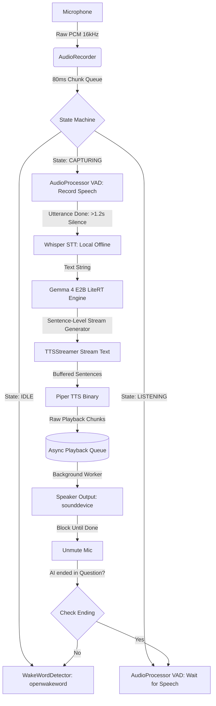

# Small Voice Assistant: Technical Architecture & Blueprint

This is a **100% offline, privacy-first, low-latency conversational voice assistant** running completely on standard consumer CPUs (e.g., Windows PC, macOS, or Raspberry Pi 5). It coordinates a high-performance local pipeline of **openWakeWord** (trigger word), **OpenAI Whisper** (Speech-to-Text), **Gemma-4 E2B/Gemma-2 2B** inside the C++ optimized **LiteRT-LM** engine (LLM reasoning), and **Piper** (Text-to-Speech).

---

## 1. System Architecture

The voice assistant is built on a non-blocking, multi-threaded asynchronous state machine to keep responsiveness high:



---

## 2. Quickstart Installation Guide

Follow these steps to get the assistant running on your local machine. You only need to run standard libraries installation and download the local models.

### Step 1: Install Python & PortAudio
Ensure you have **Python 3.10 or 3.11** installed.
* **Windows**: Python installs everything out of the box.
* **macOS**: Install PortAudio via Homebrew: `brew install portaudio`
* **Linux (Ubuntu/Debian)**: Install development libraries: `sudo apt-get install portaudio19-dev`

### Step 2: Clone the Project & Install Libraries
```bash
git clone https://github.com/vivinarya/small-voice.git
cd small-voice
pip install -r requirements.txt
```

### Step 3: Download Local Models & Assets
Since large binary assets are excluded from Git, you must download the offline models and drop them in the `assets/` folder structure:

```text
tiny-voice-assistant/
├── assets/
│   ├── gemma-4-e2b-it.litertlm            <-- [Download Step 3.1]
│   ├── piper/
│   │   └── piper.exe                      <-- [Download Step 3.2]
│   ├── piper_voices/
│   │   ├── en_US-lessac-medium.onnx       <-- [Download Step 3.3]
│   │   └── en_US-lessac-medium.onnx.json  <-- [Download Step 3.3]
│   └── wakeword_models/
│       └── hey_jarvis_v0.1.onnx           <-- [Download Step 3.4 / Wake Word Section]
```

#### 3.1 Download the Gemma Model (`.litertlm`)
* Download the C++ optimized Gemma 2B or Gemma 4 `.litertlm` file from:
  * **Hugging Face**: [LiteRT Community Models](https://huggingface.co/litert-community)
  * **Kaggle**: [Google Gemma LiteRT Models](https://www.kaggle.com/models/google/gemma/litert)
* Save the file directly as `assets/gemma-4-e2b-it.litertlm` (or update your `src/inference/engine.py` model path configuration to match the downloaded model name).

#### 3.2 Download the Piper TTS Binary
* **Windows**: Download the Windows amd64 Release zip from the [Piper GitHub Releases Page](https://github.com/rhasspy/piper/releases). Extract it, and copy `piper.exe` into `assets/piper/`.
* **macOS / Linux**: Download the corresponding Piper release for your system, place the compiled `piper` binary into `assets/piper/`, and make sure it has execution permissions (`chmod +x assets/piper/piper`). Update the path in `src/synthesis/tts_stream.py` if necessary.

#### 3.3 Download a Neural Voice Profile
* Download the standard medium English voice from Hugging Face:
  * [en_US-lessac-medium.onnx](https://huggingface.co/rhasspy/piper-voices/resolve/main/en/en_US/lessac/medium/en_US-lessac-medium.onnx)
  * [en_US-lessac-medium.onnx.json](https://huggingface.co/rhasspy/piper-voices/resolve/main/en/en_US/lessac/medium/en_US-lessac-medium.onnx.json)
* Place both files inside the `assets/piper_voices/` directory.

#### 3.4 Download a Pre-trained Wake Word Model
* If you want to use the default wake word immediately, you can download a pre-trained openwakeword `.onnx` model (like `hey_jarvis`, `alexa`, `ok_google`) directly from the [openWakeWord Pre-trained Repository](https://github.com/dscripka/openWakeWord/blob/main/notebooks/automatic_model_training.ipynb) and save it under `assets/wakeword_models/`.

---

## 3. Run the Assistant
Once your `assets/` folder is populated, simply start the assistant:
```bash
python src/main.py
```
Say **"Hey Jarvis"** (or whatever wake word model you have placed in `assets/wakeword_models/`) to trigger the conversation!

### Output Examples & CLI Showcase

Below are actual screenshots of the running Jarvis Edge Voice Assistant terminal interface, demonstrating the clean log-free console status tracking and the real-time latency reporting:

#### Wake-Word Gated Listening & Capturing


#### Real-Time Interaction & Latency Metrics


---

## 4. How to Train Your Own Custom Wake Word Model

If you want to change your assistant's name from **Jarvis** to something completely custom (e.g. *"Hey Computer"*, *"Hey Friday"*, or a custom business name), you can easily train a custom wake word using the **openWakeWord** framework.

openwakeword provides an **automated training notebook** that utilizes synthetic text-to-speech generation. This means **you don't have to record yourself saying the word thousands of times**. Instead, it uses neural voices to generate synthetic positive examples automatically!

### Step 1: Open the Automated Training Template
You can run the training process on a free Google Colab GPU notebook or locally on your own machine.
* Use openwakeword's official [Automatic Wake Word Training Notebook](https://github.com/dscripka/openWakeWord/blob/main/notebooks/automatic_model_training.ipynb).

### Step 2: Configure Your Custom Phrase
Inside the notebook configuration cells:
1. Specify your target phrase: e.g., `target_phrase = "hey friday"`.
2. The notebook will automatically call **Piper** and **Bark** (generative text-to-speech libraries) to synthesize **10,000+ positive voice clips** of different speakers, genders, speeds, pitches, and acoustics pronouncing your custom phrase.

### Step 3: Mix in Background Noise & Negative Examples
To prevent false activations when people speak other words, the training script automatically:
* Pulls **negative datasets** (speech datasets like LibriSpeech containing random conversations).
* Pulls **ambient background noise datasets** (rain, typing, wind, music, room acoustics).
* Merges the synthetic clips with the noise datasets to train the neural network to identify your phrase in loud environments.

### Step 4: Train and Export to ONNX
* The notebook trains a lightweight, fully connected neural network (based on Google's MobileNet architecture).
* Once training completes, the notebook exports the model directly into a fast `.onnx` file (e.g. `hey_friday.onnx`).

### Step 5: Load Your Custom Wake Word
1. Download your trained `hey_friday.onnx` file from the notebook.
2. Drop it into your local [assets/wakeword_models/](file:///c:/tiny/tiny-voice-assistant/assets/wakeword_models/) directory.
3. Your assistant is now instantly trained on the new wake word!

---

## 5. Technical Component Deep-Dive

### 5.1 Audio Capture & Queueing (`src/audio/recorder.py`)
* **Technology**: `sounddevice` (built on PortAudio), `queue.Queue`.
* **Details**: 
  The audio recorder opens a non-blocking input stream configured at **16,000 Hz, Mono, Int16 (16-bit PCM)**. This sample rate is the gold standard expected by both openwakeword and Whisper.
  
  Audio is captured in **80ms blocks** (1280 samples). Each chunk is immediately put into a thread-safe `queue.Queue`. A dedicated generator yields chunks, ensuring that if the CPU experiences temporary spikes during heavy LLM inference, the microphone frames are not dropped or corrupted.

### 5.2 Wake-Word Detection (`src/audio/wakeword.py`)
* **Technology**: `openwakeword` (ONNX Runtime).
* **Details**:
  Uses an ultra-lightweight, ONNX-optimized wake-word engine. The model continuously evaluates the 80ms sliding audio frames.
  
  *Feature Integration:* To prevent the wake-word engine's internal buffer from losing sync (which happens when the stream is paused during speaking), the main loop continuously feeds all mic chunks to the detector. However, activation is dynamically suppressed if the state machine is currently capturing user speech to avoid false barge-ins.

### 5.3 Voice Activity Detection (`src/audio/processor.py`)
* **Technology**: Root Mean Square (RMS) energy analysis.
* **Details**:
  Calculates the amplitude energy of each 80ms audio chunk:
  $$\text{RMS} = \sqrt{\frac{1}{N}\sum_{i=1}^{N} x_i^2}$$
  
  If the chunk's RMS exceeds the threshold (**300**), it is marked as active speech.
  
  *Tuning for Natural Speech:* To prevent the assistant from interrupting the user when they take a brief breath between words, we use a count-based hangover timer (**15 chunks = 1.2 seconds of sustained silence**) before the capturing state decides the utterance is complete.

### 5.4 Offline Speech-to-Text (`src/main.py`)
* **Technology**: `openai-whisper` (Local CPU transcription).
* **Details**:
  When an utterance is captured, the raw Int16 PCM byte array is normalized into a Float32 NumPy array (values scaled between `-1.0` and `1.0`), and processed directly in CPU memory by Whisper. This yields extremely accurate local transcriptions with a latency of **<700ms** on standard CPUs.

### 5.5 Local LLM Inference (`src/inference/engine.py`)
* **Technology**: `LiteRT-LM` (Google's optimized mobile runtimes).
* **Model**: `gemma-4-e2b-it.litertlm`.
* **Details**:
  Loads the model using the `litert_lm.Engine` optimized for single-threaded CPU execution. We inject a strict system prompt instructing Gemma to act as Jarvis, limiting responses to 1-3 highly natural conversational sentences and stripping out markdown/asterisks to prevent TTS rendering errors.
  
  *Context Preservation:* A persistent conversational session is created via `engine.create_conversation()` to enable multi-turn memory.

### 5.6 Streaming Text-to-Speech (`src/synthesis/tts_stream.py`)
* **Technology**: `Piper` (Ultra-fast local neural TTS), `subprocess`, `sounddevice`.
* **Details**:
  Piper is a highly optimized local neural text-to-speech engine that runs as a fast binary executable (`piper.exe`).
  
  *The Parallelization Architecture:*
  To drop latency, we decoupled text generation from speech synthesis using an **asynchronous queueing system**:
  
  1. The LLM yields raw text.
  2. The text is buffered until a sentence boundary (`.`, `?`, `!`) is reached.
  3. The completed sentence is immediately passed to a background Piper subprocess via `stdin` piping.
  4. Piper synthesizes the raw `.wav` byte stream and outputs it via `stdout` in **<100ms**.
  5. The resulting audio buffer is pushed to a thread-safe `playback_queue` handled by a background playback thread.
  6. The main thread immediately resumes asking the LLM generator for the next sentence, while the speaker plays the current sentence.
  7. A `playback_queue.join()` blocks the main loop at the very end of the interaction to ensure the microphone remains muted until the speaker finishes speaking entirely, preventing self-triggering feedback loops.

---

## 6. Major Design Decisions & Optimizations

| Challenge | Solution | Technical Reason |
|:---|:---|:---|
| **C++ Audio Injection Crashing Engine** | Offline Local STT | Bypasses the fragile LiteRT-LM C++ `TF_LITE_END_OF_AUDIO` errors by running CPU Whisper first and passing clean text. |
| **High Response Playback Latency** | Decoupled Playback Queue | Background thread plays audio asynchronously while the main thread keeps generating LLM tokens, cutting wait times to ~2.2s. |
| **Accidental Interruptions / Barge-ins** | High Hangover VAD + Cooldowns | Bumps silence detection window to 1.2s and handles strict state gating. |
| **Repetitive Wake Words** | Multi-Turn Automatic Question Triggers | Recognizes when the model asks a question (`?`) and switches mic directly to `LISTENING`. |
