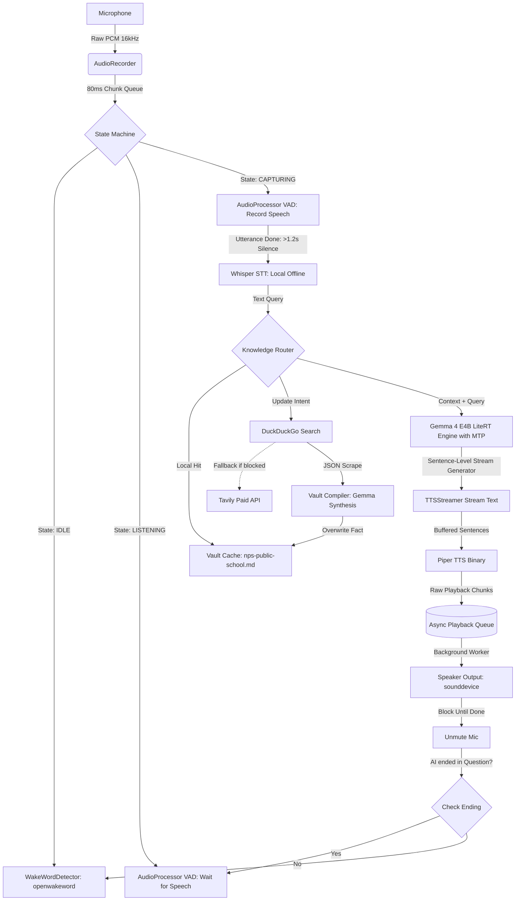
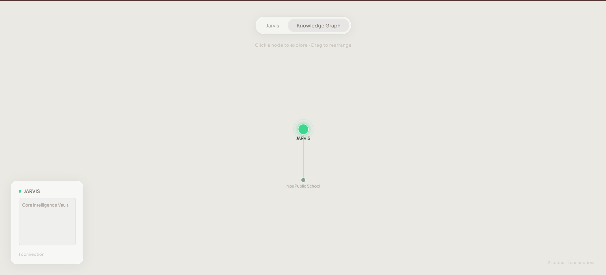

This is a **100% offline, privacy-first, low-latency conversational voice assistant** running completely on edge devices (e.g. Windows PC, macOS, or Nvidia Jetson Orin Nano). It coordinates a high-performance local pipeline of **openWakeWord** (trigger word), **Faster-Whisper** (Speech-to-Text), local LLM reasoning (using **Ollama Qwen2.5-3B** on Jetson and **Gemma-4 E4B** inside the C++ optimized **LiteRT-LM** engine on Windows), and **Piper** (Text-to-Speech).

---

## 1. System Architecture

The voice assistant is built on a non-blocking, multi-threaded asynchronous state machine to keep responsiveness high:


```mermaid
graph TD
    %% Audio Input Loop
    A[Microphone] -->|Raw PCM 16kHz| B(AudioRecorder)
    B -->|80ms Chunk Queue| C{State Machine}
    
    %% State Decisions
    C -->|State: IDLE| D[WakeWordDetector: openwakeword]
    C -->|State: LISTENING| E[AudioProcessor VAD: Wait for Speech]
    C -->|State: CAPTURING| F[AudioProcessor VAD: Record Speech]
    
    %% Processing Pipeline
    F -->|Utterance Done: >1.2s Silence| G[Whisper STT: Local Offline]
    
    %% NEW: RAG Vault & Internet Mutation
    G -->|Text Query| R1{Knowledge Router}
    R1 -->|Local Hit| R2[Vault Cache: nps-public-school.md]
    R1 -->|Update Intent| R3[DuckDuckGo Search]
    R3 -.->|Fallback if blocked| R4[Tavily Paid API]
    R3 -->|JSON Scrape| R5[Vault Compiler: Gemma Synthesis]
    R5 -->|Overwrite Fact| R2
    
    R1 -->|Context + Query| H[Gemma 4 E4B LiteRT Engine with MTP]
    
    %% Async Output Loop
    H -->|Sentence-Level Stream Generator| I[TTSStreamer Stream Text]
    I -->|Buffered Sentences| J[Piper TTS Binary]
    J -->|Raw Playback Chunks| K[(Async Playback Queue)]
    K -->|Background Worker| L[Speaker Output: sounddevice]
    
    %% Feedback loops & Smart Actions
    L -->|Block Until Done| M[Unmute Mic]
    M -->|AI ended in Question?| C1{Check Ending}
    C1 -->|Yes| E
    C1 -->|No| D

```

---

## 2. Quickstart Installation Guide

Follow these steps to get the assistant running on your local machine. You only need to install standard dependencies and download the local weights.

### Step 1: Install Python & PortAudio

Ensure you have **Python 3.10 or 3.11** installed.

* **Windows**: Python installs environment requirements out of the box.
* **macOS**: Install PortAudio via Homebrew: `brew install portaudio`
* **Linux (Ubuntu/Debian)**: Install development libraries: `sudo apt-get install portaudio19-dev`

### Step 2: Clone the Project & Install Libraries

```bash
git clone https://github.com/vivinarya/small-voice.git
cd small-voice
pip install -r requirements.txt
```

### Step 3: Install Core Edge AI Engine Extensions

To enable fast execution of the Large Language Model completely on standard CPU engines, update and sync your virtual environment with the `litert` system binaries:

```bash
pip install litert litert-lm --upgrade
```

### Step 4: Configure Search & Download Local Assets

If you want the assistant to autonomously search the internet, we provide a dual-layer fallback:
1. **DuckDuckGo (Free)**: Installed automatically via `pip install duckduckgo-search`. No keys required.
2. **Tavily (Fallback)**: Create a `.env` file at the root with `TAVILY_API_KEY=your_key_here`.

Since large binary assets are excluded from Git, you must download the offline models and drop them in the `assets/` folder structure:

```text
tiny-voice-assistant/
├── assets/
│   ├── gemma-4-E4B-it.litertlm            <-- [Download Step 4.1]
│   ├── piper/
│   │   └── piper.exe                      <-- [Download Step 4.2]
│   ├── piper_voices/
│   │   ├── en_US-lessac-medium.onnx       <-- [Download Step 4.3]
│   │   └── en_US-lessac-medium.onnx.json  <-- [Download Step 4.3]
│   └── wakeword_models/
│       └── hey_baymax_v0.1.onnx           <-- [Generated in Section 4]

```

#### 4.1 Download the Gemma Model (`.litertlm`)

* Download the C++ optimized Gemma 2B or Gemma 4 `.litertlm` file from:
* **Hugging Face**: [litert-community/gemma-4-E2B-it-litert-lm](https://huggingface.co/litert-community/gemma-4-E2B-it-litert-lm)
* **Kaggle**: [Google Gemma 4 Models](https://www.kaggle.com/models/google/gemma-4)


* Save the file directly as `assets/gemma-4-E4B-it.litertlm`.

#### 4.2 Download the Piper TTS Binary

* **Windows**: Download the Windows amd64 Release zip from the [Piper GitHub Releases Page](https://github.com/rhasspy/piper/releases). Extract it, and copy `piper.exe` into `assets/piper/`.
* **macOS / Linux**: Download the corresponding Piper release for your system, place the compiled `piper` binary into `assets/piper/`, and make sure it has execution permissions (`chmod +x assets/piper/piper`).

#### 4.3 Download a Neural Voice Profile

* Download the standard medium English voice configuration from Hugging Face:
* [en_US-lessac-medium.onnx](https://huggingface.co/rhasspy/piper-voices/resolve/main/en/en_US/lessac/medium/en_US-lessac-medium.onnx)
* [en_US-lessac-medium.onnx.json](https://huggingface.co/rhasspy/piper-voices/resolve/main/en/en_US/lessac/medium/en_US-lessac-medium.onnx.json)


* Place both files inside the `assets/piper_voices/` directory.

#### 4.4 Wake Word Model

* The assistant uses a custom-trained **hey_baymax_v0.1.onnx** model. This ONNX file (along with its weights file `hey_baymax_v0.1.onnx.data`) is generated by running our local training pipeline script (see Section 4).

### Step 5: Build the NCERT Retrieval Index (Optional)

If you want the assistant to answer questions from NCERT textbook content rather than relying solely on model knowledge, you can build a local retrieval index.

1. Place NCERT PDFs in the appropriate subject folders:
   ```text
   data/ncert/
   └── class8/
       └── science/
           └── *.pdf
   ```
   You can add other classes and subjects following the same `data/ncert/classN/subject/` pattern.

2. Run the index builder:
   ```bash
   python scripts/build_index.py --src data/ncert --out data/index --embed minilm
   ```

3. The script uses a MiniLM embedding model to chunk and index the PDFs. The resulting index is saved to `data/index/` and loaded automatically at runtime.

> **This step is optional.** Without it, the assistant answers entirely from its trained model knowledge. The index only adds value if you have relevant PDF content to query against.

---

## 3. Run the Assistant

Once your `assets/` folder is populated, simply start the assistant from the project root:

```bash
python src/main.py
```

Say **"Hey Baymax"** to trigger the conversation!

### Configuration (config.yaml)

A `config.yaml` file at the project root controls which backends are active. You can override any value with environment variables without editing the file.

**Default config.yaml layout (Windows Dev Mode):**
```yaml
engine:
  backend: litert                         # litert | llama_cpp | ollama
  model_path: assets/gemma-4-E4B-it.litertlm
  n_gpu_layers: 0

stt:
  backend: faster_whisper                 # whisper | faster_whisper
  model: small.en
  compute_type: int8

tts:
  backend: piper
  voice_path: assets/piper_voices/en_US-lessac-medium.onnx
```

**Environment variable overrides** (take precedence over config.yaml):

| Variable | Purpose | Example |
| --- | --- | --- |
| `ENGINE_BACKEND` | Switch LLM runtime | `litert`, `llama_cpp`, `ollama` |
| `MODEL_PATH` | Path/Name of the model file | `assets/gemma-4-E4B-it.litertlm`, `qwen2.5:3b` |
| `STT_BACKEND` | Speech-to-text engine | `faster_whisper`, `whisper` |
| `TTS_BACKEND` | Text-to-speech engine | `piper` |

**Example: switching to Jetson Orin Nano configuration (using Ollama)**
Copy `config-orin.yaml` to `config.yaml`:
```bash
cp config-orin.yaml config.yaml
```
Which configures:
```yaml
engine:
  backend: ollama
  model_path: qwen2.5:3b
```

### Output Examples & CLI Showcase

Below are actual screenshots of the running Jarvis Edge Voice Assistant terminal interface, demonstrating the clean log-free console status tracking and the real-time latency reporting:

#### Wake-Word Gated Listening & Capturing


#### Real-Time Interaction & Latency Metrics


---

## 4. Custom Wake Word Training & Generation (Baymax)

To transition from the old Jarvis model to **Baymax**, a custom openWakeWord model was trained and integrated directly using your local Piper TTS engine:

*   **Training Pipeline (`scripts/train_wakeword.py`):**
    This script programmatically generates positive voice clips ("Hey Baymax", "Baymax") and negative voice clips ("Alexa", "Siri", "NCERT", etc.) using the Piper voice profile, applies data augmentation (varying speed, volume, and adding noise), resamples the audio to 16kHz, extracts features using openWakeWord's shared embedding backbone, trains a 2-layer classifier in PyTorch, and exports the final model to ONNX.
*   **ONNX Model Artifacts:**
    *   `assets/wakeword_models/hey_baymax_v0.1.onnx` (the ONNX classifier structure)
    *   `assets/wakeword_models/hey_baymax_v0.1.onnx.data` (the weights file)
*   **Integration (`src/audio/wakeword.py`):**
    Updated default wake word model paths to load `hey_baymax_v0.1.onnx` and adjusted the prediction confidence threshold to `0.2` for the custom classification head.

To train/re-generate the model, run:
```bash
python scripts/train_wakeword.py
```

---

## 5. Reachy Mini Robot Integration

The assistant can run in fully integrated **Robot Mode**, connecting to a physical **Reachy Mini** (controlled by a Raspberry Pi Zero 2W):

*   **Integrated Subprocess Camera Stream (`pi_robot/robot_server.py`):**
    The Pi Zero server automatically runs the `rpicam-vid` command as a background subprocess on startup, streaming the camera video feed on TCP port `5000` to the Jetson.
*   **Audio & Movement Playback Sockets (`src/audio/robot.py`):**
    We added a `RobotController` that connects to the Pi Zero's Motor Server (port `5001`) and Speaker Server (port `5003`).
    *   When the assistant speaks, all synthesized audio is streamed directly to the robot's speakers.
    *   It initiates minor speaking sways and neck gestures in a background loop while speaking to simulate natural conversation, and automatically centers the servos with `go_home()` when speaking ends.

---

## 6. How to Run the System from Scratch

### Setup on the Robot (Pi Zero 2W)
1. SSH into the Pi Zero 2W.
2. Navigate to the Pi robot code directory:
   ```bash
   cd /reachy_mini/Reachy_mini_custom/reachy_mini_v6/pi_robot
   ```
3. Start the server (this opens ports 5001, 5002, 5003 and camera stream 5000):
   ```bash
   python3 robot_server.py
   ```

### Option A: Running on Windows (Dev/Test Mode)
1. In `config.yaml`, ensure the robot connection is disabled:
   ```yaml
   robot:
     enabled: false
     ip: ""
   ```
2. Start the local assistant loop:
   ```powershell
   python src/main.py
   ```

### Option B: Running on the Jetson Orin Nano (Robot Mode)
1. SSH into the Jetson Orin Nano.
2. Copy `config-orin.yaml` to `config.yaml`:
   ```bash
   cp config-orin.yaml config.yaml
   ```
3. Edit `config.yaml` to enable the robot connection and point to the Pi Zero's IP address:
   ```yaml
   robot:
     enabled: true
     ip: "192.168.1.XX"  # Replace with the Pi Zero 2W's IP address
   ```
4. Activate the virtual environment and run the assistant:
   ```bash
   source jarvis-env/bin/activate
   python3 src/main.py
   ```

---

## 7. Technical Component Deep-Dive

### 7.1 Audio Capture & Queueing (`src/audio/recorder.py`)
* **Technology**: `sounddevice` (built on PortAudio), `queue.Queue`.
* **Details**: Opens a non-blocking input stream at **16,000 Hz, Mono, Int16 (16-bit PCM)**, capturing in **80ms blocks** (1280 samples). Each chunk is put into a thread-safe `queue.Queue` to prevent dropping frames.

### 7.2 Wake-Word Detection (`src/audio/wakeword.py`)
* **Technology**: `openwakeword` (ONNX Runtime).
* **Details**: Continuously evaluates sliding audio frames against our custom `hey_baymax_v0.1.onnx` classifier. If the score exceeds `0.2`, the assistant triggers the listening state.

### 7.3 Voice Activity Detection (`src/audio/processor.py`)
* **Technology**: Root Mean Square (RMS) energy analysis.
* **Details**: Computes RMS amplitude energy of each 80ms chunk. Speech is detected if RMS > **300**, with a hangover timer of **1.2 seconds of silence** to prevent self-interruption.

### 7.4 Offline Speech-to-Text (`src/main.py`)
* **Technology**: `openai-whisper` (Local CPU transcription).
* **Details**: Normalizes raw Int16 PCM into a Float32 array and runs Whisper locally in memory, transcribing the user's speech in **<700ms**.

### 7.5 Local LLM Inference & Web Search Fallback (`src/inference/engine.py` & `src/main.py`)
* **Technology**: `LiteRT-LM` / `Ollama`.
* **Details**: Loads the offline model (Gemma-4 E4B or Qwen2.5-3B). 
* **Conversational Interceptor & Web Search**:
  * Greeting or basic chat queries bypass internet searches to save latency.
  * Real-time keywords (e.g. *"weather"*, *"news"*, *"forecast"*) or explicit instructions (e.g. *"search the internet"*) bypass local static RAG documents and directly trigger the DuckDuckGo/Tavily web search fallback.
  * Identity queries (e.g. *"who are you"*) instantly respond as Baymax: *"Hi, I am Baymax, your personal AI assistant to help you with all your needs."*

### 7.6 Streaming Text-to-Speech (`src/synthesis/tts_stream.py`)
* **Technology**: `Piper` (ultra-fast neural TTS).
* **Details**: Sentence-level buffering allows background Piper subprocess synthesis to complete in **<100ms** while the speaker handles playing the previous sentences.

---

## 8. Major Design Decisions & Optimizations

| Challenge | Solution | Technical Reason |
| --- | --- | --- |
| **C++ Audio Injection Crashing Engine** | Offline Local STT | Bypasses the fragile LiteRT-LM C++ `TF_LITE_END_OF_AUDIO` errors by running CPU Whisper first and passing clean text. |
| **High Response Playback Latency** | Decoupled Playback Queue | Background thread plays audio asynchronously while the main thread keeps generating LLM tokens, cutting wait times to ~2.2s. |
| **Accidental Interruptions / Barge-ins** | High Hangover VAD + Cooldowns | Bumps silence detection window to 1.2s and handles strict state gating. |
| **Repetitive Wake Words** | Multi-Turn Automatic Question Triggers | Recognizes when the model asks a question (`?`) and switches mic directly to `LISTENING`. |
| **Textbook vs Real-time Weather/News** | Context Routing Interception | Forcing web search for real-time keywords prevents offline static RAG from trying to answer questions it cannot know. |
| **Robot Integration** | Dual-Mode Socket Controller | Connects over TCP to Pi Zero motor and speaker ports if enabled, otherwise falls back gracefully to local sound cards. |
